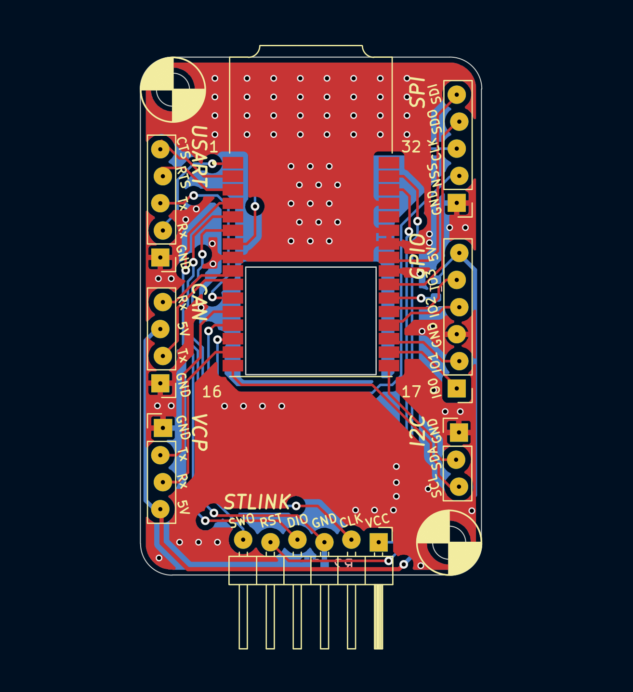
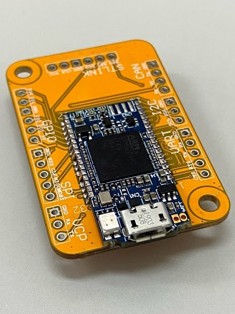

# STlinkV3-Adapter
Custom developed board that allow you to use the [STlink-V3mini](https://www.st.com/en/development-tools/stlink-v3mini.html) or [STlink-V3MODS](https://www.st.com/en/development-tools/stlink-v3mods.html). This adapter board was designed to retain the STDC14 connector from [STlink-V3mini](https://www.st.com/en/development-tools/stlink-v3mini.html).

**SWD connector**
|Pin |   Description  |
|----|----------------|
| 1  | Target_VCC     |
| 2  | Target_SWCLK   |
| 3  | Target_GND     |
| 4  | Target_SWDIO   |
| 5  | Target_NRST    |
| 6  | Target_SWO     |

## Preview of the board:

[More information](/Main_Project/PCB_Project.pdf)

The newly designed interposer board has not passed production verification, be careful of to use the adapter.

### PCB SAMPLE EXPERT
[COMPANY](http://us.jetpcb.com/) 

[COMPANY](https://star-class.wixsite.com/1pcb) 

## Prerequisite
[KiCAD](https://www.kicad.org/)
[STlink-V3 Module](https://www.snapeda.com/parts/STLINK-V3MODS/STMicroelectronics/view-part/?ref=mouser&welcome=home)

## STMicroelectronics Documents
- [STLINK-V3MINI](https://www.st.com/content/st_com/en/products/development-tools/hardware-development-tools/hardware-development-tools-for-stm32/stlink-v3mini.html)
- [User manual UM2448](https://www.st.com/resource/en/user_manual/dm00526767-stlinkv3set-debuggerprogrammer-for-stm8-and-stm32-stmicroelectronics.pdf)
- [User manual UM2502](/Documents/UM2502-stlink-v3-debuggers-programmers-for-stm32-stmicroelectronics.pdf)
- [STLinkV3-Bridge](https://www.st.com/en/development-tools/stlink-v3-bridge.html)

## Contact us

Please feel free to contact me if you need any further information.  Email: yingcaho.tw@gmail.com

# Contributer

Thank [@JojoS62](https://github.com/JojoS62) created a small box that can be 3D printed:
https://www.thingiverse.com/thing:5101077