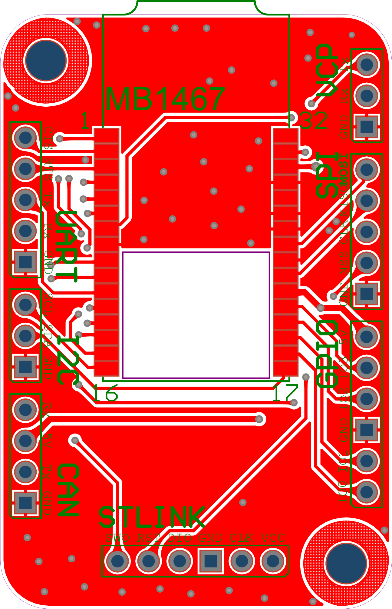
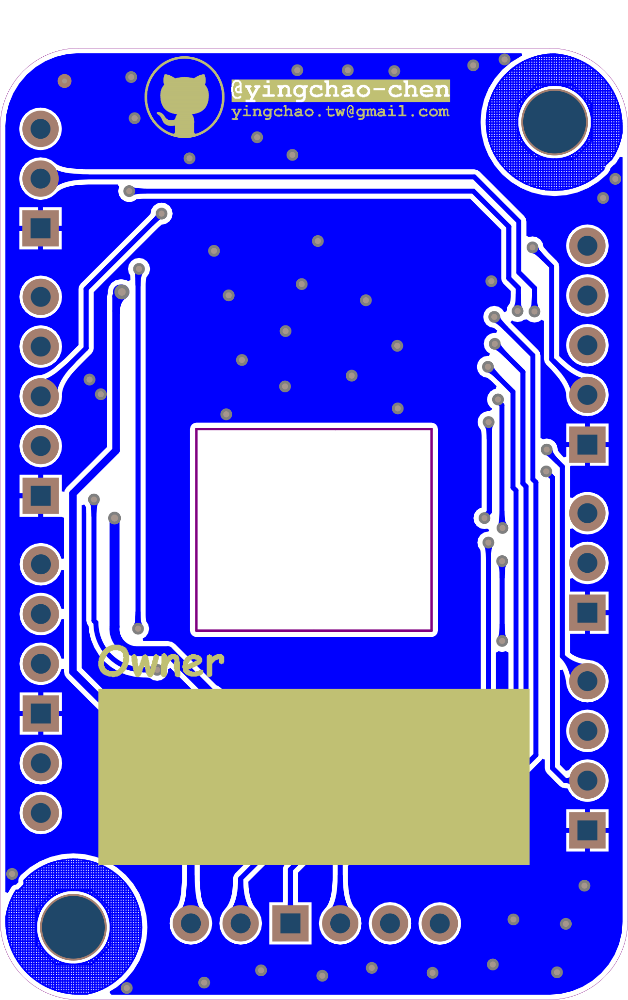
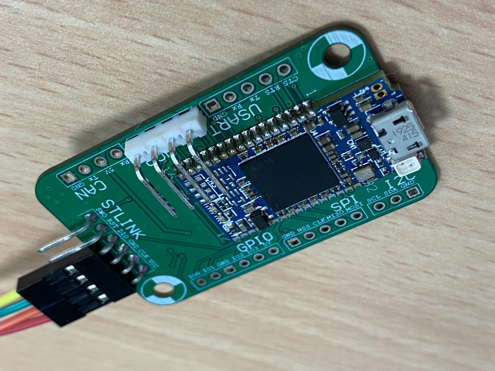

# STlinkV3-Adapter
Custom developed board that allow you to use the new STLINK-V3Mini. 
This adapter board was designed to retain the STDC14 connector from stlinkv3-mini.

**SWD connector**
|Pin Number|Description|
|----------|-----------|
|       1  | T_VCC     |
|       2  | T_SWCLK   |
|       3  | GND       |
|       4  | T_SWDIO   |
|       5  | T_NRST    |
|       6  | T_SWO     |

## Preview of the board:

[More information](/Main_Project/PCB_Project.pdf)

 

### PCB SAMPLE EXPERT
[COMPANY](http://us.jetpcb.com/) 
Export date at 2020/06/11

[COMPANY](https://star-class.wixsite.com/1pcb) 

## Prerequisite
[Altium Designer](https://www.altium.com/)

## STMicroelectronics Documents
- [STLINK-V3MINI](https://www.st.com/content/st_com/en/products/development-tools/hardware-development-tools/hardware-development-tools-for-stm32/stlink-v3mini.html)
- [User manual UM2448](https://www.st.com/resource/en/user_manual/dm00526767-stlinkv3set-debuggerprogrammer-for-stm8-and-stm32-stmicroelectronics.pdf)
- [User manual UM2502](/Documents/UM2502-stlink-v3-debuggers-programmers-for-stm32-stmicroelectronics.pdf)
- [STLinkV3-Bridge](https://www.st.com/en/development-tools/stlink-v3-bridge.html)

## Social Media Links

Please feel free to contact me if you need any further information. 
Email: yingcaho.tw@gmail.com

## Update History
#### 2020/06/10
1. modify VCP + Vcc & STLINK GNDDetect -> GND (PIN3)
2. STLINK reference UM2448 at page 24 (SWD connector)
3. Will remove all connected Vcc pins and update the repo again

#### 2020/06/09
1. update product pcb
